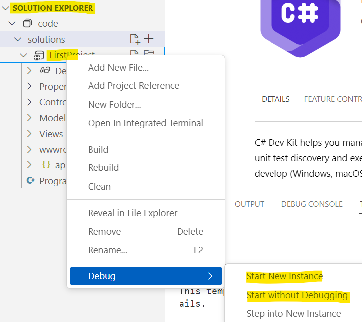

## Overview

| | |
| --------- | --------------------------- |
| Exercise Folder | Demo |
| Builds On | None |
| Time to complete | 20 minutes

### Visual Studio Community 2022
1. Open Visual Studio Community 2022
1. Create a new ASP.Net MVC project named *Demo*
	- Change the solution name to **Labs**
	
Review the project layout & files
Familiarize yourself with running & debugging the application

### Visual Studio Code
1. Open Visual Studio Code
1. Create a new folder and open the folder with Visual Studio Code.  This will be your *solution* folder.  We will create subfolders for each project in the solution.
1. Create a new folder named *FirstProject* in the solution folder
1. Open an integrated terminal in that folder (right-click the folder and select *Open in Integrated Terminal*)
1. Run this command in the terminal `dotnet new list` to see a list of available project templates
1. Run `dotnet new mvc to create a new ASP.Net MVC project *FirstProject* folder
  * The command generates a .csproj file with the same name as the folder.
  * If you have the *C# Dev Kit* extension installed, a .sln file will be created in the top-level solution folder.  You can use the solution explorer to run the project, debug, and manage the solution. 

Verify the SDK version in the .csproj file.  It should be the latest version.  If not, update it to the latest version.
```xml
<TargetFramework>net8.0</TargetFramework>